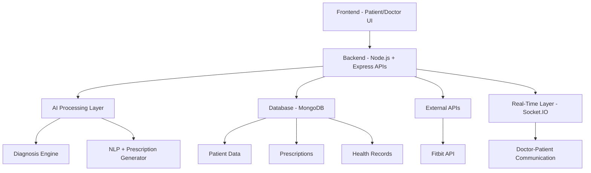

TEAM : PLAN B
TEAM : 
      1. AAKRISHTA SINHA (23051318)
      2. SHREYA (23051381)
      3. HIMANSHU MISHRA (23053534)
      4. HARSH VERMA (23051751)

# 🏥 HealthPulse — AI-Powered Real-Time Healthcare Platform

## 🚀 Overview
**HealthPulse** is a full-stack healthcare platform that integrates **AI-driven diagnosis, real-time communication, wearable data, and automated prescription generation** into a single intelligent system.

It transforms fragmented healthcare workflows into a **connected, real-time, and data-driven ecosystem**.

---

## 🎯 Problem Statement
Modern healthcare systems face several challenges:
- Fragmented patient data  
- Unstructured doctor-patient interactions  
- Delayed diagnosis  
- Lack of real-time health monitoring  
- Inefficient emergency response  

---

## 💡 Solution
HealthPulse provides:
- AI-assisted diagnosis  
- Real-time doctor-patient communication  
- Automated prescription generation  
- Wearable device integration  
- Smart hospital and doctor recommendations  

---

## ⚙️ Key Features

### 🤖 AI-Based Diagnosis
- Analyzes symptoms  
- Provides preliminary medical insights  

### 📞 Real-Time Communication
- Chat & video consultation  
- Built using Socket.IO  

### 🧾 Prescription Automation
- Converts conversations into structured prescriptions  

### ⌚ Wearable Integration
- Fitbit API integration  
- Tracks heart rate, activity, and health metrics  

### 🏥 Smart Recommendations
- Suggests doctors and hospitals  

### 🚨 Emergency Escalation
- Fast routing for critical situations  

---

## 🏗️ Tech Stack

| Layer              | Technology Used              |
|------------------|-----------------------------|
| Frontend         | HTML, CSS, JavaScript       |
| Backend          | Node.js, Express.js         |
| Database         | MongoDB                     |
| Real-Time Layer  | Socket.IO                   |
| APIs             | Fitbit API, AI services     |

---

## 🔄 System Workflow

1. Patient enters symptoms  
2. AI processes and suggests possible conditions  
3. Patient connects with doctor (real-time)  
4. Conversation is recorded and analyzed  
5. Prescription is generated automatically  
6. Wearable data enhances diagnosis  
7. System recommends hospitals or escalates emergencies  

---

## 🧠 Architecture Overview

---

## ⚡ System Design Highlights

- 🔹 Modular API architecture (microservice-like design)  
- 🔹 Event-driven real-time communication  
- 🔹 Scalable backend using Node.js  
- 🔹 Flexible data storage with MongoDB  
- 🔹 AI integration for intelligent decision-making  

---

## 🧠 How It Works (End-to-End)

- Users input symptoms  
- AI provides initial diagnosis  
- Real-time consultation begins  
- Conversation is processed using NLP  
- Structured prescription is generated  
- Wearable data enhances decision-making  
- Emergency cases are escalated instantly  

---

## 🔐 Security & Future Scope

### 🔒 Future Enhancements
- End-to-end encryption  
- HIPAA-compliant storage  
- Authentication & role-based access  

### 🚀 Scalability
- Kafka for real-time data streaming  
- Cloud deployment (AWS/GCP)  
- Containerization (Docker)  

### 🤖 Advanced AI
- Predictive healthcare analytics  
- Personalized treatment plans  
- Early disease detection  

---

## 🌍 Vision

HealthPulse aims to become a scalable SaaS healthcare platform that:
- Enhances doctor efficiency  
- Improves patient outcomes  
- Enables real-time, intelligent healthcare delivery  

---

## 📌 Conclusion

HealthPulse is not just a project — it is a next-generation healthcare system that combines AI, real-time systems, and wearable technology to deliver smarter and faster medical care.

---

# ⭐ If you like this project, give it a star!
